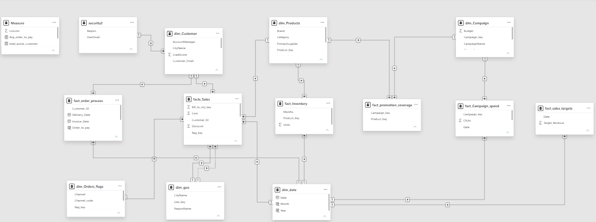

Data modeling

Sales and Marketing Data Model

📌 Overview

This repository contains a structured relational data model designed to analyze sales performance, inventory levels, and marketing campaign effectiveness. By connecting various business domains, this model provides a solid foundation for building interactive dashboards and generating business insights.

🛠️ Tools & Technologies

* Power BI:** Used for importing data, building the relational model, and creating visualizations.
* DAX (Data Analysis Expressions):** Used to write custom measures and calculations.

🗄️ Data Architecture

The model uses a star/snowflake schema to organize data efficiently for analytical queries.

Ke-y Components:

* Fact Tables (The Metrics): Track quantitative business events. Key tables include `facts_Sales`, `fact_Inventory`, `fact_Campaign_spend`, and `fact_order_process`.
* Dimension Tables (The Context): Provide descriptive attributes to filter and group the data. Key tables include `dim_Customer`, `dim_Products`, `dim_Campaign`, `dim_geo`, and `dim_date`.

📈 Key Performance Indicators (KPIs)

Based on the tables and measures in this model, the following core KPIs are tracked:

* Sales & Revenue:** Total Sales, Target Revenue vs. Actuals, and Discounts applied.
* Customer Metrics:** Total Active Customers and average order-to-pay time.
* Marketing ROI:** Total Campaign Spend, Clicks, and promotional coverage effectiveness.
* Inventory Management:** Monthly unit counts and stock levels by product.
